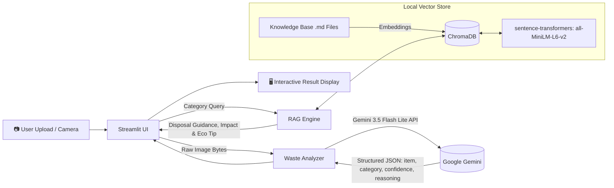

# ♻️ EcoSort AI — Intelligent Waste Classification & Disposal Assistant
TRY ME : (https://ecosort-ai0.streamlit.app/) 

[](https://www.python.org/downloads/)
[](https://streamlit.io/)
[](https://ai.google.dev/)
[](https://www.trychroma.com/)
[](LICENSE)

> **"Every item has a right way to be thrown away. Identify. Sort. Sustain."**

**EcoSort AI** is a computer vision and Retrieval-Augmented Generation (RAG) powered web application designed to eliminate recycling confusion. By combining the multimodal vision capabilities of **Google Gemini** with localized semantic retrieval through **ChromaDB** and **Sentence-Transformers**, EcoSort AI identifies waste items from uploaded images, classifies them into standard categories, and serves immediate, actionable disposal instructions, environmental impact notes, and eco-friendly tips.

---

## 🌟 Key Features

- 📸 **Multimodal Waste Recognition**: Upload an image (JPG, PNG, WebP) of any waste item; Google Gemini vision identifies the object and assigns a classification confidence score.
- 🧠 **Context-Aware RAG Guidance**: Local vector search powered by ChromaDB and `all-MiniLM-L6-v2` matches the classified waste to tailored disposal protocols, recycling practices, and environmental insights.
- 🎨 **Modern Glassmorphic UI**: Streamlit-based web interface featuring floating animated gradient blobs, custom typography (Space Grotesk & IBM Plex Sans), dynamic confidence meters, and mobile-responsive layouts.
- ⚡ **Optimized In-Memory Caching & Deduplication**: Image hash-based caching prevents redundant Gemini API calls, and content-hash document IDs prevent re-indexing unchanged knowledge base records.
- 🛡️ **Robust Validation & Error Handling**: Strict JSON schema validation on model outputs with graceful handling for blurry images, empty inputs, and unrecognized objects.
- 🧪 **Comprehensive Test Coverage**: Includes end-to-end integration tests, RAG retrieval verification, and a 700+ line QA test suite.

---

## 🏗️ Architecture & Pipeline



---

## 🗂️ Supported Waste Categories

EcoSort AI classifies items into seven standard waste categories, backed by dedicated knowledge base guides:

| Category | Typical Items | Key Handling Guideline |
| :--- | :--- | :--- |
| **Plastic** | Water bottles, food containers, jugs, packaging | Rinse clean, check resin identification code (#1–#7), flatten. |
| **Paper** | Cardboard boxes, office paper, newspapers, magazines | Keep clean and dry; discard food-soiled paper or compost if untreated. |
| **Glass** | Beverage bottles, food jars | Rinse thoroughly; separate by color if required; keep Pyrex and mirrors separate. |
| **Metal** | Aluminum soda cans, tin food cans, foil, scrap metal | Rinse residue; metal can be infinitely recycled without quality loss. |
| **Organic** | Fruit/vegetable peels, coffee grounds, food scraps, yard waste | Divert from landfills into municipal or home composting systems. |
| **E-Waste** | Broken phones, batteries, cables, circuit boards, small appliances | Take to certified e-waste drop-offs; never place into household curbside bins. |
| **Other** | Mixed materials, hazardous chemicals, textiles | Directs user to consult local municipal guidelines. |

---

## 🛠️ Technology Stack

| Layer | Technology | Purpose |
| :--- | :--- | :--- |
| **Frontend UI** | [Streamlit](https://streamlit.io/) | Interactive dashboard with custom CSS glassmorphism and animations |
| **Vision Model** | [Google Gemini 3.5 Flash Lite](https://ai.google.dev/) (`google-genai` SDK) | Image identification, category classification, confidence scoring, and reasoning |
| **Embeddings** | [sentence-transformers](https://www.sbert.net/) (`all-MiniLM-L6-v2`) | Local, free, lightweight semantic vector generation |
| **Vector Database** | [ChromaDB](https://www.trychroma.com/) | Persistent vector indexing and semantic retrieval |
| **Image Processing**| [Pillow (PIL)](https://pillow.readthedocs.io/) | Client image parsing, format verification, and synthetic test image generation |
| **Configuration** | [python-dotenv](https://github.com/theskumar/python-dotenv) | Secure API key and environment variable management |

---

## 📁 Repository Structure

```text
ecosort-ai/
├── app.py                  # Main Streamlit web application & UI presentation
├── waste_analyzer.py       # Gemini API client, prompts, and output validators
├── rag_engine.py           # ChromaDB indexer and semantic retrieval module
├── requirements.txt        # Project dependencies
├── .env.example            # Template for environment variables
├── .gitignore              # Files and folders excluded from Git tracking
│
├── knowledge_base/         # Curated recycling & disposal markdown guides
│   ├── ewaste.md
│   ├── glass.md
│   ├── metal.md
│   ├── organic.md
│   ├── paper.md
│   └── plastic.md
│
├── chroma_db/              # Persistent ChromaDB vector store (created on run)
│
└── tests & utilities/
    ├── test_analyzer.py    # Unit tests for Gemini image analysis
    ├── test_rag.py         # Unit tests for ChromaDB retrieval
    ├── test_integration.py # Full end-to-end integration test pipeline
    └── test_qa.py          # Comprehensive QA and edge case test suite
```

---

## 🚀 Getting Started

### Prerequisites

- **Python 3.10+** installed on your system.
- A **Google Gemini API Key** (available from [Google AI Studio](https://aistudio.google.com/)).

### 1. Clone the Repository

```bash
git clone https://github.com/Dhivya313/ecosort-ai.git
cd ecosort-ai
```

### 2. Create and Activate a Virtual Environment

**Windows (PowerShell):**
```powershell
python -m venv venv
.\venv\Scripts\Activate.ps1
```

**Linux / macOS:**
```bash
python3 -m venv venv
source venv/bin/activate
```

### 3. Install Dependencies

```bash
pip install -r requirements.txt
```

### 4. Configure Environment Variables

Copy `.env.example` to create a `.env` file:

```bash
cp .env.example .env
```

Open `.env` and insert your Google Gemini API key:

```env
GEMINI_API_KEY=your_actual_gemini_api_key_here
```

---

## 🖥️ Running the Application

Launch the Streamlit app with:

```bash
streamlit run app.py
```

Once running, navigate to `http://localhost:8501` in your browser.

1. Drag and drop or browse to select an image of a waste item (or take a photo if using a mobile device).
2. The AI will analyze the image and display:
   - **Identified Item** & **Category Pill**
   - **Confidence Meter** (High / Medium / Low)
   - **AI Reasoning**
   - **Recommended Disposal Method**
   - **Environmental Impact**
   - **Actionable Eco Tip**

---

## 🧪 Running the Tests

The repository includes standalone validation and integration test suites:

```bash
# 1. Test the waste analyzer with synthetic test images
python test_analyzer.py

# 2. Test ChromaDB embedding and category retrieval
python test_rag.py

# 3. Test full end-to-end image-to-RAG pipeline
python test_integration.py

# 4. Run the comprehensive QA test suite
python test_qa.py
```

---

## ⚖️ Responsible AI Disclaimer

> ⚠️ **Notice**: Disposal rules and recycling capabilities differ widely across municipal districts and processing facilities. EcoSort AI provides recommendations based on general environmental best practices. Always verify specific sorting instructions with your local waste management authority.

---

## 🤝 Contributing

Contributions are always welcome!
1. Fork the Project
2. Create your Feature Branch (`git checkout -b feature/AmazingFeature`)
3. Commit your Changes (`git commit -m 'Add some AmazingFeature'`)
4. Push to the Branch (`git push origin feature/AmazingFeature`)
5. Open a Pull Request

---

## 📄 License

Distributed under the MIT License. See `LICENSE` for more details.
